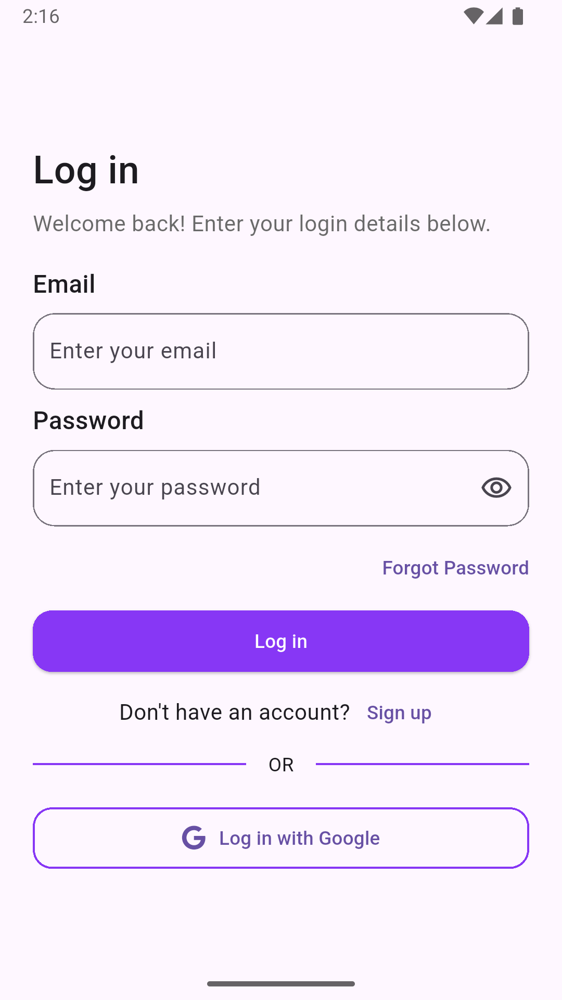
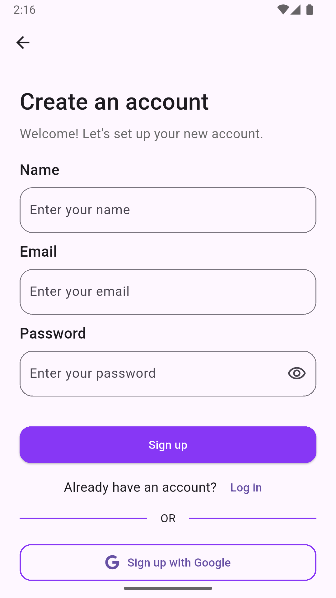
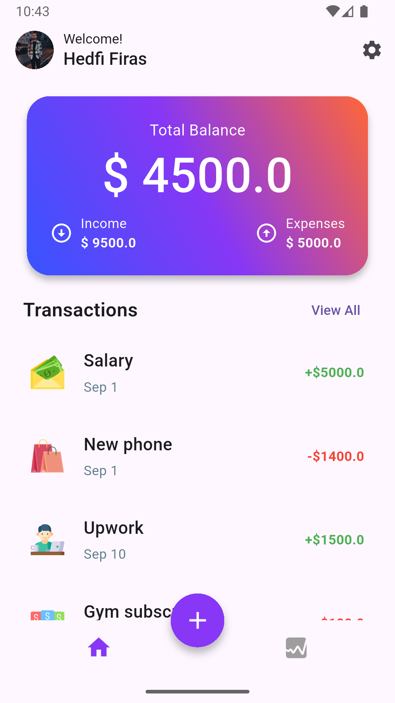
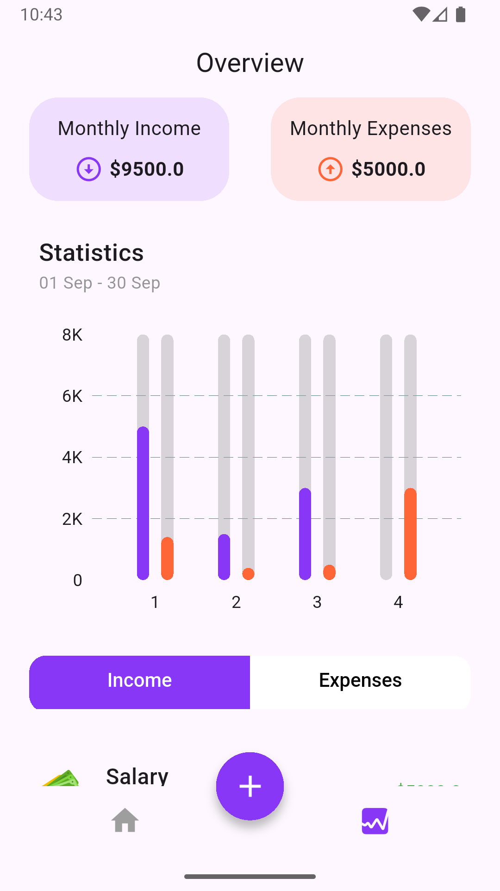
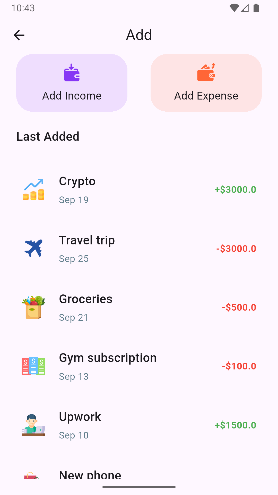
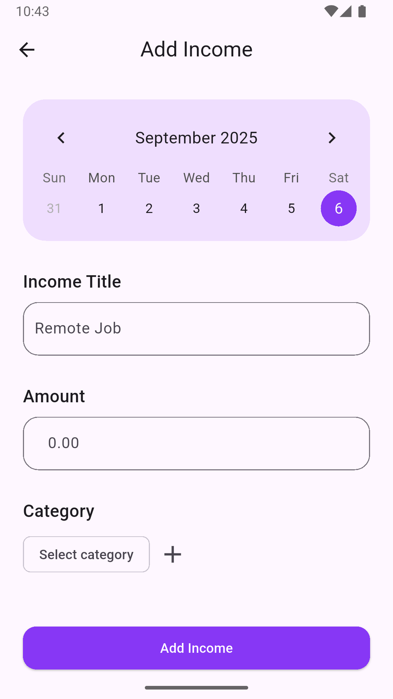
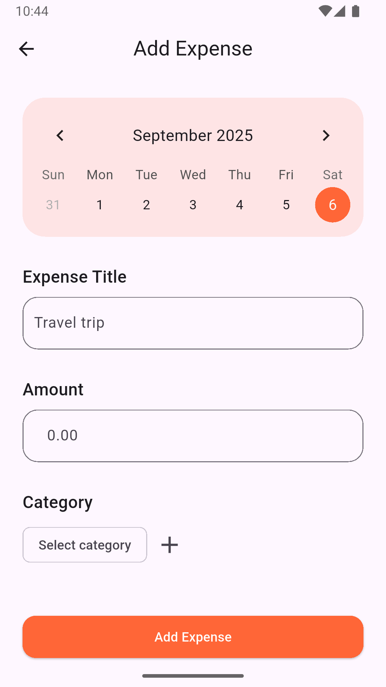
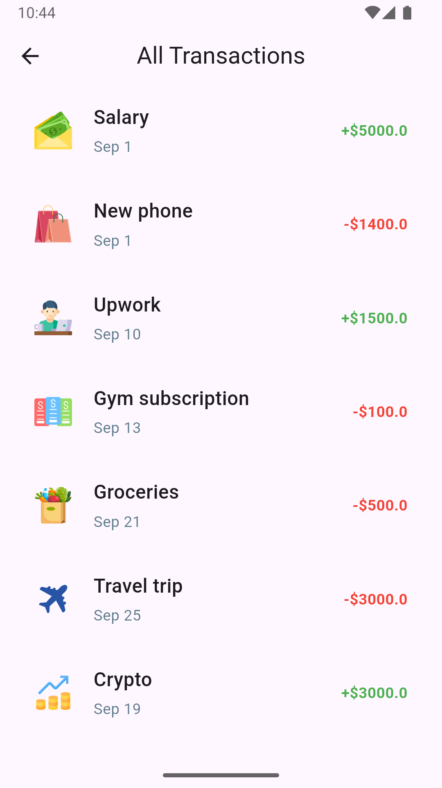
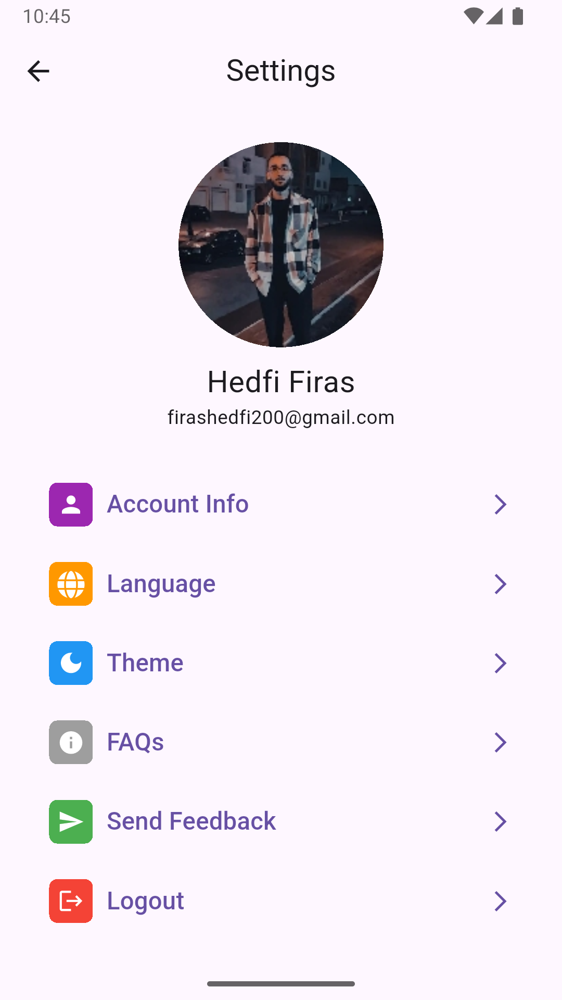

<div align="center">
<h1>SpendWise</h1>
</div>
<div align="center">
   
</div>

## 📱 Screenshots

<table style={border:"none"}>
   <tr>
        <td></td>
        <td></td>
        <td></td>
   </tr>
   <tr>
        <td></td>
        <td></td>
        <td></td>
        
   </tr>
        <td></td>
        <td></td>
        <td></td>
   </tr>

</table>

## ✨ Features

- **User Authentication**: Sign up and sign in with email/password or Google authentication.
- **Transaction Management**: Add, edit, delete, and view financial transactions with full CRUD functionality.
- **Monthly Statistics Dashboard**: Get insights into your income and expenses with comprehensive monthly stats.
- **Profile Customization**: Update account details such as username and profile picture.
- **Theming**: Toggle between dark and light mode for an optimal viewing experience.
- **Offline Functionality**: Access all app features without internet, powered by Hive local storage.
- **Responsive Design**: Optimized for various screen sizes and devices.
<!--- **Offline Support**: Works without internet connection-->

## 🚀 Getting Started

### Prerequisites

Before running this project, make sure you have the following installed:

- [Flutter](https://flutter.dev/docs/get-started/install) (version 3.0.0 or higher)
- [Dart](https://dart.dev/get-dart) (version 3.0.0 or higher)
- [Android Studio](https://developer.android.com/studio) or [VS Code](https://code.visualstudio.com/)
- [Xcode](https://developer.apple.com/xcode/) (for iOS development, macOS only)

### Installation

1. **Clone the repository**

   ```bash
   git clone https://github.com/firashedfi5/SpendWise.git
   cd SpendWise
   ```

2. **Install dependencies**

   ```bash
   flutter pub get
   ```

3. **Run the app**

   ```bash
   flutter run
   ```

### Platform-specific Setup

#### Android

- Minimum SDK version: 21
- Target SDK version: 34
- Make sure you have an Android device connected or an emulator running

#### iOS

- Minimum iOS version: 11.0
- Xcode 12.0 or higher
- Valid Apple Developer account (for device testing)

## 🏗️ Project Structure

```
lib/
├── main.dart                          # 🚀 App entry point and initialization
├── core/                              # 🏛️ Core functionality and shared components
└── features/                          # 📱 Feature-based architecture
    └── feature/                   
        ├── data/                      # 💾 Data layer
        │   ├── data_sources/          # 🌐 Data sources
        │   ├── models/                # 📊 Models
        │   └── repositories/          # 📚 Repository implementations
        └── presentation/              # 🎭 UI layer
            ├── manager/               # 🎛️ state management (BLoC/Cubit)
            └── views/                 # 👀 Screens and widgets
```

## 📦 Dependencies

### Main Dependencies

- `flutter/material.dart` - Material Design components and widgets
- `dartz` - Functional programming utilities (Either, Option types)
- `dio` - Powerful HTTP client for API requests and interceptors
- `flutter_bloc` - State management using BLoC pattern
- `go_router` - Declarative routing and navigation
- `google_nav_bar` - Animated bottom navigation bar with Google style
- `shared_preferences` - Local key-value storage for app preferences
- `skeletonizer` - Loading skeleton animations for better UX
- `table_calendar` - Customizable calendar widget with events support
- `flutter_native_splash` - Create native splash screens for iOS and Android

### Dev Dependencies

- `flutter_test` - Built-in testing framework for unit and widget tests
- `flutter_lints` - Official Dart linting rules for code quality
- `flutter_launcher_icons` - Generate app launcher icons for all platforms
- `mockito` - Mock objects for unit testing and dependency isolation

## 🧪 Testing

Run the test suite:

```bash
# Run all tests
flutter test

# Run tests with coverage
flutter test --coverage

# Run integration tests
flutter drive --target=test_driver/app.dart
```

## 🚀 Building for Production

### Android (APK)

```bash
flutter build apk --release
```

### Android (App Bundle)

```bash
flutter build appbundle --release
```

### iOS

```bash
flutter build ios --release
```

## 🔗 Backend

This app connects to a Node.js backend API. You can find the backend repository here:

- **Repository**: [SpendWise Backend Repo](https://github.com/firashedfi5/SpendWise-Backend)
- **Technology**: ASP.NET Core Web API
[comment]: <> (- **Documentation**: API documentation available in the backend repo)

## 🤝 Contributing

1. Fork the project
2. Create your feature branch (`git checkout -b feature/AmazingFeature`)
3. Commit your changes (`git commit -m 'Add some AmazingFeature'`)
4. Push to the branch (`git push origin feature/AmazingFeature`)
5. Open a Pull Request

## 📄 License

This project is licensed under the MIT License - see the [LICENSE](LICENSE) file for details.

## 📞 Support

If you have any questions or need help, please:

1. Check the [Issues](https://github.com/firashedfi5/SpendWise/issues) page
2. Create a new issue if your problem isn't already reported
3. Contact me at: <firashedfi4@gmail.com>

## 🔄 Changelog

### Version 1.0.0

- Initial release
- Basic functionality implemented
- Cross-platform support

---

**Happy coding! 🎉**
